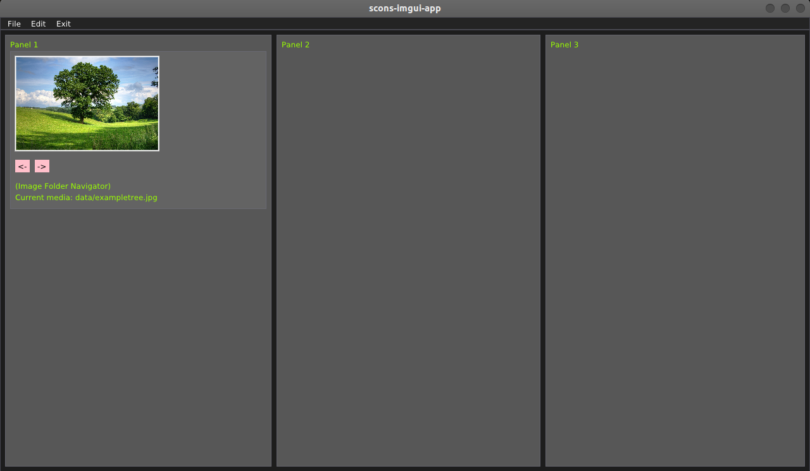

# imgui-app
Cross platform desktop ImGUI application in both CMake and SCons. Tests on 1) Ubuntu 22.04, 2) Windows 11, 3) macOS 12.2. Includes libraries and backends.

<!--  -->


##### Commands
```
(For CMake Ubuntu 22.04:)
$ rm -rf build && mkdir build && cd build
$ cmake ..
$ cmake --build .
$ ./cmake-imgui-app
(For Scons Ubuntu 22.04 and Windows 11:)
$ scons --clean
$ scons
(Exports to:)
$ ./ubuntu/application/scons-imgui-app
$ ./windows/application/scons-imgui-app.exe
(For macOS 12.2+):
$ cd macos
$ ./download_libs.sh && ./build_app.sh
```


